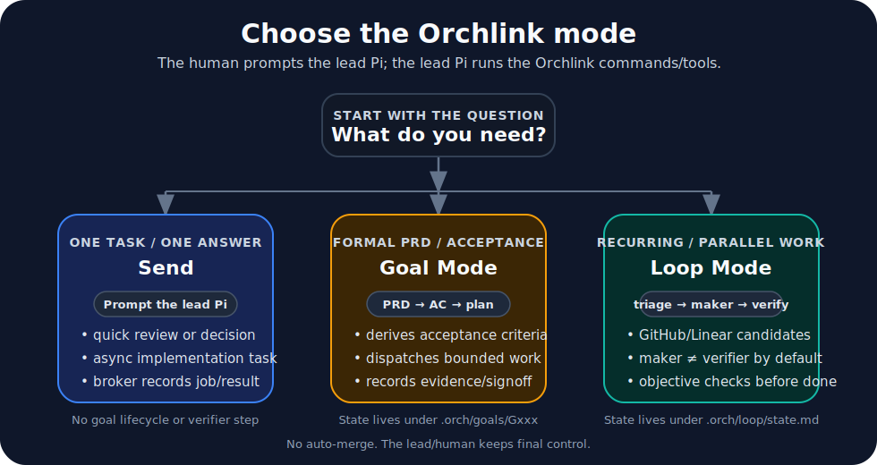

# Pi Orchlink

Orchlink is a local coordination layer for Pi coding agents. It connects one lead Pi session to named worker Pi sessions through a local broker, so a lead agent can delegate work, get reviews, run goals, and manage loops — all on your machine.

## What Orchlink does

- **Routes tasks between agents.** The lead Pi sends work to named workers (`work`, `review`, `bg-test`) via a local HTTP broker. Each worker is a separate Pi session with its own context.
- **Tracks work state.** Tasks, talks, sessions, and results are tracked by the broker. The lead reads results, checks whether work is idle, and cancels stale tasks.
- **Runs Goal Mode.** Create a goal from a PRD, derive acceptance criteria and a plan, dispatch bounded work slices, verify objective checks, record evidence, and sign off subjective criteria.
- **Runs Loop Mode.** Triage work items, dispatch each to a maker worker, verify with a separate verifier worker, run objective checks (tests, lint), and reach `done` only on an accepted verdict. Worktree isolation can be required per project.
- **Schedules loop ticks.** Install a crontab or systemd timer that fires `orch loop tick` on a cadence. Each fire is a fresh bounded process, not a daemon.
- **Isolates parallel workers.** `orch work --worktree-create` creates a `git worktree` per worker so two makers don't touch the same files.
- **Connects to external tools.** GitHub and Linear connectors discover pull requests, issues, and CI failures as loop candidates. Tokens are loaded from env or external files, never stored in project state.
- **Generates project skills.** `orch init` writes lead and worker skills under `.orch/skills/` so agents know the project's conventions, commands, and recovery procedures.
- **Checks broker security.** `orch doctor` reports whether the broker is loopback-only, whether the API key is default, and whether the running broker accepts the project key.

## Three modes



**Send** — use this for one question, one review, or one implementation task. It is asynchronous by default; add `--wait` for a blocking gate. The broker records the job and result, but Orchlink does not create a goal, lifecycle state, or verifier step.

**Goal Mode** — use this for PRD-driven work. Orchlink stores acceptance criteria, a plan, evidence, blockers, and signoff under `.orch/goals/Gxxx/`.

**Loop Mode** — use this for recurring or parallel work. Orchlink stores loop items in `.orch/loop/state.md`, sends ready items to maker workers, requires a verifier by default, and can run objective checks before `done`.

## Install

You need Python 3.11+, `git`, and Pi installed as `pi`.

**Linux or macOS:**

```bash
curl -fsSL https://raw.githubusercontent.com/bakhshb/pi-orchlink/main/install.sh | bash
```

Install Pi Orchlink on Windows PowerShell:

```powershell
Invoke-WebRequest https://raw.githubusercontent.com/bakhshb/pi-orchlink/main/install.ps1 -OutFile install.ps1
powershell -ExecutionPolicy Bypass -File .\install.ps1
```

Windows options:

```powershell
powershell -ExecutionPolicy Bypass -File .\install.ps1 -Ref main -Force
powershell -ExecutionPolicy Bypass -File .\install.ps1 -SkillsOnly
powershell -ExecutionPolicy Bypass -File .\install.ps1 -NoSkills
powershell -ExecutionPolicy Bypass -File .\install.ps1 -Uninstall
```

Windows installs into `%LOCALAPPDATA%\orchlink`, creates `%LOCALAPPDATA%\orchlink\bin\orch.cmd`, and can install the general skill at `%USERPROFILE%\.agents\skills\orchlink`.

Advanced overrides: `ORCHLINK_REPO_URL`, `ORCHLINK_REF`, `ORCHLINK_INSTALL_DIR`, `ORCHLINK_BIN_DIR`, `ORCHLINK_PYTHON`, `ORCHLINK_SOURCE_DIR`. Close running `orch lead` / `orch work` / Pi terminals before uninstalling.

If your shell cannot find `orch`:

```bash
export PATH="$HOME/.local/bin:$PATH"
```

> **Windows support is currently beta.** The installer supports basic install, update, uninstall, and command shims, but shell/PATH behavior can vary between PowerShell, CMD, Git Bash, and Pi's tool shell. Linux/macOS remain the primary tested paths.

## Start a project

Normal use has two phases:

1. Start the project and the lead Pi session from a shell.
2. Talk to the lead Pi in natural language.

```bash
cd /path/to/your/project
orch init
orch lead
```

After `orch lead` opens, prompt the lead Pi. Examples:

```text
Start a background worker for this project, then ask it to review the auth module without editing files.
```

```text
Start a background worker named review with model openai/codex-max and thinking xhigh. Use it for review-only tasks.
```

The lead Pi can call `orch work --background`, `orch send`, `orch jobs`, `orch goal ...`, and `orch loop ...` as tools. You normally do not type those commands during agent work.

Manual equivalents are useful for visible worker terminals, debugging, scripting, and recovery:

```bash
# visible worker in another terminal
orch work

# background worker without blocking the current terminal
orch work --background

# fresh task-scoped background worker that exits after one completed reply
orch work --background --new --replace --oneshot
```

`orch work --background` starts the headless Pi RPC worker named `work`, writes `.orch/run/orch-work.pid` and `.orch/run/orch-work.log`, waits for readiness, and returns. Named workers need no YAML setup; ask the lead Pi for them by name.

Headless RPC workers invoke Pi with `--approve`, which is tool approval suitable for unattended operation. Use them only for scoped local coding tasks you would allow to run without per-tool confirmation. Orchlink coordinates workers; it is not a shell-command sandbox.

## Send tasks

You normally delegate by prompting the lead Pi:

```text
Send work a blocking review of this function before I change it. Keep it short and do not edit files.
```

```text
Send work an async task to implement the export endpoint. While it works, inspect the API tests yourself. Read the exact worker result before telling me it is done.
```

The lead Pi turns those prompts into blocking or async `orch send` calls and retrieves async results with `orch jobs --result`. You do not need to type those commands unless you are debugging, scripting, or recovering from an interruption.

## Watch background workers in Pi

Run `/orchlink` in the lead Pi to open a compact worker list. Select an active worker and press Enter or `f` to follow its visible assistant output.

Follow controls appear only when applicable:

- The mouse wheel scrolls the transcript inside the panel.
- Up/Down scroll one line; Page Up/Page Down scroll one page.
- Manual scrolling pauses auto-scroll; End returns to live output.
- Tab/Shift-Tab switch active workers when more than one is available, without mixing transcript or scroll position.
- Escape returns to the worker list; `q` closes the panel without cancelling work.

The broker persists a bounded local transcript so switching workers or reopening the panel can resume from the saved cursor. Visible output uses Pi's Markdown theme, including headings, emphasis, and syntax-highlighted code blocks. The follow view excludes model thinking, unknown stream events, provider payloads, secrets, and raw tool output. A truncation marker appears if retained history no longer includes the requested cursor.

## Goal Mode

Goal Mode is for PRD/plan-driven work where the lead should not claim done until acceptance criteria are verified.

You normally start it by prompting the lead Pi:

```text
Start a goal from docs/export-prd.md. Derive acceptance criteria and a plan, then stop for my approval before implementation.
```

Then continue with prompts such as:

```text
Review the goal gate with me. If the acceptance criteria and plan are complete, approve the gate and start bounded work.
```

```text
Work this goal until the acceptance criteria are done or blocked. Verify evidence before saying it is complete.
```

Goal Mode writes durable state under `.orch/goals/Gxxx/`: source, acceptance criteria, plan, coverage, goal status, evidence, blockers, and history. The lead Pi uses `orch goal ...` commands as tools. Use the table for debugging, scripting, or manual recovery.

| Agent/manual command | What it does |
| --- | --- |
| `orch goal review G001` | Show source, ACs, plan, coverage, and warnings before approval. |
| `orch goal derive G001` | Ask worker to derive acceptance criteria and a plan. |
| `orch goal gate G001 approve` | Approve the combined AC/plan gate. |
| `orch goal work G001 --until done` | Dispatch bounded worker slices until done, gated, blocked, or capped. |
| `orch goal audit G001` | Ask worker to audit artifacts and evidence without editing. |
| `orch goal signoff G001 AC-4` | Human-approve a subjective core AC. |

## Loop Mode

Loop Mode is for recurring or parallel work that needs a maker, a separate verifier, and objective checks before `done`.

You normally use it by prompting the lead Pi:

```text
Set up Loop Mode for this repo. Use a maker worker and a separate review worker. Configure pytest as a required objective check. Then do one triage tick and show me the loop items before dispatching anything.
```

```text
Run the loop for ready GitHub issues. Use the maker/reviewer split, run required checks, and stop if anything is rejected or blocked. Do not merge automatically.
```

The lead Pi turns those prompts into `orch loop ...`, `orch work ...`, and file edits under `.orch/`. The setup below is written as human prompts first, with manual equivalents shown only to make the state and files clear.

### Loop Mode setup

1. Ask the lead Pi to start the loop workers and require maker isolation.

```text
Start the default Loop Mode workers in the background. Create an isolated Git worktree for maker, use review for verification, and require worktree isolation for loop dispatch.
```

Manual equivalent:

```bash
orch work --background --name maker --worktree-create --base main
orch work --background --name review
```

The lead enables enforcement in `.orch/project.yaml`:

```yaml
loop:
  require_worktree_isolation: true
```

With this setting, Loop Mode refuses maker dispatch unless the active maker session reports a registered Git worktree outside the project root. Without it, legacy non-isolated dispatch remains allowed. Visible workers are also valid if you want separate terminals; omit `--background` but keep `--worktree-create` for the maker.

2. Ask the lead Pi to configure objective checks.

```text
Configure Loop Mode checks. Make pytest required and ruff optional.
```

The lead writes `.orch/loop/checks.yaml`:

```yaml
checks:
  - id: pytest
    command: "python3 -m pytest tests/ -q"
    required: true
  - id: ruff
    command: "ruff check src/"
    required: false
```

A failed required check forces `REJECTED` regardless of the verifier text.

3. Optional: ask the lead Pi to configure the GitHub connector.

```text
Configure Loop Mode to read GitHub candidates from owner/repo, limit 10, default branch main. Do not store any token in .orch.
```

The lead edits `.orch/project.yaml`:

```yaml
loop:
  connectors:
    github:
      repo: owner/repo
      limit: 10
      default_branch: main
```

GitHub connector behavior:

- open pull requests become candidates
- open issues become candidates only when labeled `bug`, `enhancement`, `good first issue`, or `help wanted`
- failing commit status on the default branch becomes a CI-failure candidate

4. Provide the GitHub token outside `.orch`. This is a human/admin step, not a prompt to store secrets in the repo.

```bash
export ORCHLINK_GITHUB_TOKEN="ghp_..."
```

Or use the external secrets directory:

```bash
mkdir -p ~/.config/orchlink/secrets
printf '%s' 'ghp_...' > ~/.config/orchlink/secrets/github.token
chmod 600 ~/.config/orchlink/secrets/github.token
```

Do not put tokens in `.orch/project.yaml`.

5. Ask the lead Pi to triage once and show the result before dispatching.

```text
Do one Loop Mode triage tick, then show me the loop items. Do not mark anything ready yet.
```

New GitHub candidates are stored in `.orch/loop/state.md` as `triaged`. They are not dispatched until you or the lead marks them ready.

6. Approve a loop item for work.

```text
Mark issue-123 ready, then run one checked loop tick. Stop and show me the result before any merge or release.
```

The checked tick recovers stale state, triages new candidates, dispatches ready items to the maker, collects maker results, sends work to the verifier, runs objective checks, and exits.

For a repeated foreground run, prompt the lead Pi with a cap:

```text
Run Loop Mode with checks every 60 seconds, at most 10 steps. Stop on blocked or rejected work.
```

For scheduled use, prompt the lead Pi to install a schedule:

```text
Install a Loop Mode schedule that runs one checked tick every 30 minutes. Show me the exact schedule before installing it.
```

An item reaches `done` only through:

```text
ready → dispatching → running → awaiting_verdict → verifying → done
```

No auto-merge. No daemon. Each scheduled fire is a fresh bounded `orch loop tick` process.

Loop state lives in `.orch/loop/state.md` as human-readable markdown with a fenced YAML block.

## Worker reference

Most users ask the lead Pi to start or target workers. These details are for visible worker terminals, debugging, scripting, and agent/manual recovery.

- Each worker name handles one task at a time. Different names run independent work.
- `orch work --background` starts a headless RPC worker with Pi `--approve` for unattended tool use. `--oneshot` exits after one reply.
- `orch work --worktree-create --base main` creates a `git worktree` for the worker.
- `orch work --model <model> --thinking <level>` pins a worker's model and thinking.
- Talk Mode (`orch talk`, `orch say`, `orch close`) is for lead↔worker discussion without file edits.

## Recovery

For normal use, prompt the lead Pi to recover context:

```text
Use `orch resume` first. Tell me the active task or goal, lead/work sessions, last broker checkpoint, drifted leases, and the one recommended next command.
```

`orch resume` is the first manual command to use when returning after an interruption, broker restart, cancelled task, or compacted conversation. It prints the active task or goal, lead/work sessions, the last broker checkpoint, drifted leases, and one recommended next command in a single plain-text report.

Manual recovery commands:

```bash
orch resume          # recovery report after interruption
orch jobs --idle     # exit 0 if no active work
orch jobs --active   # what is still busy
orch jobs --result T002  # read a completed result
orch jobs --cancel T002 -m "reason"  # cancel stale work
orch goal show Gxxx  # check a specific goal's acceptance evidence
```

Use narrower commands when you already know what you need: `orch jobs --idle` for a quick safe/unsafe check, `orch jobs` for recent task/talk rows, `orch sessions` for lead/work session leases, and `orch goal show Gxxx` for a specific goal's acceptance evidence.

## Project files

```text
.orch/
  project.yaml          # project config (auto-generated random API key)
  skills/
    lead.md
    work.md
    references/
      goal-mode.md
      lead-commands.md
      recovery.md
      review-gates.md
  loop/
    state.md            # loop items and lifecycle state
    checks.yaml         # objective check definitions
  goals/
    Gxxx/               # per-goal artifacts
  run/                  # broker, worker, and session runtime files
```

Do not commit `.orch/`. Refresh skills with `orch init --refresh-skills`.

## Command reference

Most users prompt the lead Pi instead of typing these during normal work. The lead can call these commands as tools. This reference is for agents, debugging, setup scripts, and manual recovery.

| Command | Use |
| --- | --- |
| `orch init` | Create or refresh `.orch/`. |
| `orch lead` | Start or reopen the visible lead Pi session. |
| `orch work` | Start visible or background named workers. |
| `orch send work --wait -t T001 -m "..."` | Block for a short gate: review, decision, or blocker. |
| `orch send work -t T002 -m "..."` | Dispatch async implementation, review, tests, or research. |
| `orch jobs` | List recent task and Talk jobs. |
| `orch jobs --active` | Show active/open work. |
| `orch jobs --idle` | Exit 0 only when no active/blocking worker work remains. |
| `orch jobs --result T002` | Print a terminal result or Talk summary. |
| `orch jobs --wait T002` | Block for one exact result only when it gates your next action. |
| `orch jobs --cancel T002 -m "..."` | Cancel stale or unneeded work. |
| `orch sessions` | Show lead/worker sessions, model, runtime, readiness, and leases. |
| `orch talk`, `orch say`, `orch close` | Manage short Talk Mode discussions. |
| `orch doctor` | Check setup, broker compatibility, Pi command, and generated skills. |
| `orch resume` | Show recovery state and recommended next action. |
| `orch goal ...` | Run Goal Mode. |
| `orch loop ls` | List loop items and their states. |
| `orch loop next ITEM --maker NAME` | Reserve a ready item for a maker and mark it dispatched. |
| `orch loop verify ITEM --verifier NAME` | Verify with a separate worker. Use `tick --run-checks` or `watch --run-checks` for objective checks. |
| `orch loop tick` | Run one bounded loop invocation and exit. |
| `orch loop watch` | Run a foreground loop watch. |
| `orch loop schedule --every 30m --install` | Install a crontab/systemd timer that fires `orch loop tick`. |
| `orch broker status`, `orch broker watch`, `orch broker run` | Raw broker diagnostics and foreground broker run. |
| `orch update` | Update Orchlink and print restart guidance. |

## Configuration

Project settings live in `.orch/project.yaml`. You usually do not need to edit it.

If you change the broker port, update both `broker.url` and `broker.port`:

```yaml
broker:
  url: http://127.0.0.1:8788
  host: 127.0.0.1
  port: 8788
```

One broker can serve multiple projects only when those projects are configured with the same broker authentication key/API key. Orchlink does not currently implement multi-key broker support. Within a shared-key broker, Orchlink scopes commands by `project_id` so results from another repo are refused.

## Security

- `orch init` generates a random per-project broker API key. The broker refuses to start with a missing or default `change-me` key.
- `orch doctor` reports broker bind exposure, API key state, and whether the running broker accepts the project key.
- `orch broker run` warns when binding to a non-loopback interface.
- Headless RPC workers run Pi with `--approve` for unattended tool use.
- Orchlink does not sandbox worker shell commands. Scope worker tasks clearly.
- Worktree isolation (`--worktree`) changes the working directory but is not a security boundary.
- Cancellation is best-effort once Pi has started a tool call.

## Development

```bash
pip install -e ".[dev]"
python3 -c "import pytest, sys; sys.exit(pytest.main(['tests', '-v']))"
python3 -m compileall src/orchlink
```